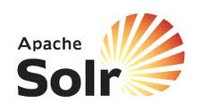

## SOLR Remote Monitoring Plugin

 The Dynatrace Remote Monitoring Plugin for SOLR enables remote monitor plugin monitoring for applications using the SOLR Search Engine. The monioring pluing accesses SOLR statistics using the SOLR administration interface, so no JMX access is required

Find further information in the [dynaTrace community](https://community.dynatrace.com/community/display/DL/SOLR+Remote+Monitoring+Plugin) 
